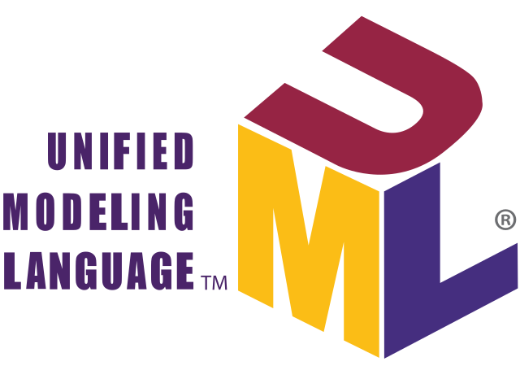
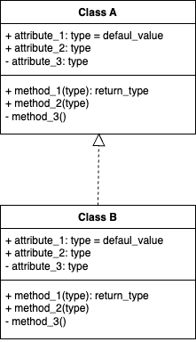

## ¿Qué es UML?

**UML** (**Unified Modeling Language)** es un lenguaje estándar de modelado de sistemas orientados a objetos.

Esto significa que tendremos una manera gráfica de representar una situación, justo como hemos venido viendo. A continuación te voy a presentar los elementos que puedes utilizar para hacer estas representaciones.

Las **clases** se representan así:

En la parte superior se colocan los atributos o propiedades, y debajo las operaciones de la clase. Notarás que el primer caracter con el que empiezan es un símbolo. Este denotará la visibilidad del atributo o método, esto es un término que tiene que ver con Encapsulamiento y veremos más adelante a detalle.

Estos son los niveles de **visibilidad** que puedes tener:

* `-` private
* `+` public
* `#` protected
* `~` default

Una forma de representar las relaciones que tendrá un elemento con otro es a través de las flechas en UML, y aquí tenemos varios tipos, estos son los más comunes:

### Asociación

Como su nombre lo indica, cada vez que esté referenciada este tipo de relación se utiliza una flecha con punta abierta y significa que ese elemento contiene al otro en su definición. La flecha apuntará hacia la dependencia.

Con esto vemos que la Clase A está asociada y depende de la Clase B.

### Herencia

La herencia se expresa con una fleca con punta cerrada o triangulas.La dirección de la flecha irá desde el hijo hasta el padre.

En el ejemplo se describe que la Clase B hereda de la Clase A

### Agregación

El tipo de realación agregación se parece a la asociación en que un elemento dependerá del otro, pero en este caso será: Un elemento dependerá de muchos otros. Aquí tomamos como referencia la multiplicidad del elemento. Lo que comúnmente conocerías en Bases de Datos como Relaciones uno a muchos.

En este ejemplo se describe que la Clase A contiene varios elementos de la Clase B. Estos últimos son comúnmente representados con listas o colecciones de dato.

### Composición

En la composición, la relación es similar a la agregación, solo que su relación es totalmente compenetrada, de tal modo que, conceptualmente una de estas clases no podría vivir si no existiera la otra.

Existen otras símbolos que periten expresar relaciones particulares. Por lo que, es importante que si deseas profundizar en el uso de UML, investiges más acerca del tema. Además, de la posibilidad de crear otro tipo de diagramas bajo el estándar de UML.