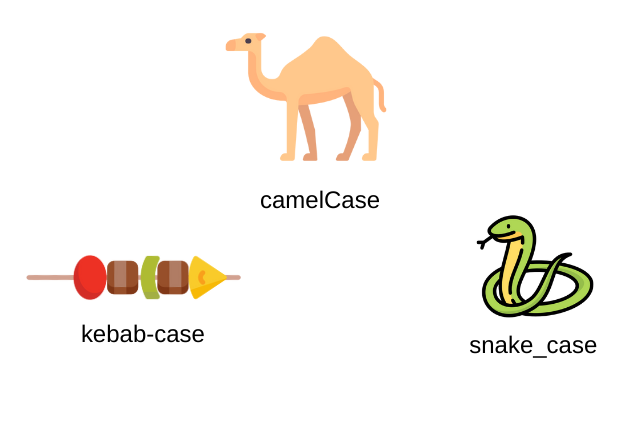

# Fundamentos de Python

## 1. Objetivos

* Comprender los conceptos de la programación procedimental en Python.
* Implementar estructuras del control en Python.
* Implementar listas, tuplas y diccionarios.
* Implementar programación modular mediante funciones.

## Scripts y Jupyter Notebooks

* Python es un lenguaje de programación de propósito general que tiene la características de crear código fácil de leer, depurar y extender.
* Es __open source__!!
* Es un lenguaje de programación interpretado, a través de scripts, se pueden construir programas para la solución de problemas complejos.
* El uso de Jupyter Notebooks permite crear prototipos de programas para crear soluciones complejas.

[Ambientes virtuales](../00-ambiente/README.md)

## Tipos de datos

En Python los programa manipulan objeto de de datos y son almacenados de acuerdo a su tipo (escalares y no escalares).

Los tipos de datos básicos o escalares son:

* `int`: números enteros, ejemplo: `5`, `-100`
* `float`: números de punto flotante o decimales, ejemplo: `3.27`, `2.0`
* `booleano`: valor lógico (`True` o `False`)
* `NoneType`: es un tipo especial y tiene un único valor `None`.

Los tipos de datos no escalares son:

* `String`: secuencia de caracteres, por ejemplo, "hola mundo", 'bike', "Bike's Mike" 
* `List`: 
* `Dictionary`:

> La función `type()` permite conocer el tipo de dato.

```python
type(5)
type(3.0)
```

[**`Ejemplo 1`**](./ejemplo-01/variables_tipos_datos.ipynb)

> La conversión de tipos o *casting* permite convertir un tipo de datos en otros.

```python
float(3)
int(3.9)
round(3.9)
```

## Expresiones

- Mediante la combinación de objetos y operadores se forman las expresiones

```python
3 + 2
5 / 3
```

- Una expresión tiene un valor, el cual tiene un tipo

```python
3 + 2 # tiene el valor 5 y el tipo int
5 / 3 # tinene el valor 1.666667 y tiene el tipo float 
```

- Python evalúa las expresiones y almacena el valor (__No almacena las expresiones__).
- La sintaxis para una expresión simple es:

```text
<objeto> <operador> <objeto>
```

### Operadores aritméticos

Los operadores aritméticos de Python son los siguiente:

| Operador | Operación        | Ejemplo  |
|----------|------------------|----------|
| `+`      | Suma             | `5 + 5`  |
| `-`      | Resta            | `7 - 5`  |
| `*`      | Multiplicación   | `3 * 7`  |
| `/`      | División entera  | `5 / 2`  |
| `//`     | División precisa | `5 / 2`  |
| `%`      | Residuo          | `5 % 2`  |
| `**`     | Potencia         | `5 ** 3` |

> Las conversiones o casting de variables es importante para asegurar los resultados esperados.
> `int()`, `float()` y `str()` son los métodos que nos permiten convertir un tipo de dato a otro, entero, flotante o cadena, respectivamente.

[**`Ejemplo 2`**](./ejemplo-02/operadores_aritmeticos.ipynb)

### Precedencia de operadores

| Operador | Operación | Nivel de procedencia |
| --- | --- | --- |
| () | (5 + 4) * 3 | 1 |
| +, - | +25, -6.745 | 2 |
| *, /, % | 5*5, 25/5 | 3 |
| +, - | 2+3 | 4 |

📌  Determinar el resultado de las siguientes expresiones:

a. `6 + 2 * 3 -4 /2`

b. `5 * ( 5 + (6-2) + 1`

c. `7 - 6 / 3 + 2 * 3 / 2 - 4 / 2`

d. `7 * 10 - 5 % 3 * 4 + 9`


## Variables


En las ciencias de la computación no aplican las ecuaciones matemáticas ya que no se utiliza el conocimiento declarativo, si no el conocimiento imperativo. 

**Matemáticas**

```
a + 2 = b - 1
x * x = y
```

**Variables**

```
a = b + 1
m = 10
F = m * 9.98
```

En Python la asignación de datos a las `variables` se realiza mediante `=`.

* La sintaxis es:

```python
nombre_de_la_variable = valor
```

`valor` puede ser cualquier tipo de dato, incluso puede ser el resultado de una expresión.

```python
pi = 355 / 113
```

```python
# Probar los siguientes casos
x = 6
6 = x
x * y = 3 + 4
xy = 3 + 4
```

Cuando se realiza la reasignación de una variable, en realidad esa variable apunta un nuevo lugar de memoria.

> ⚠️ uso del modo __snake_case__ para definir el identificador de una variable.



**Estilos de codificación**

```python
# realizar operaciones
a = 355/113 * (2.2**2)
c = 355/113 * (2.2*2)
```

```python
p = 355/113
r = 2.2 
# multiplicar p con r al cuadrado
a= p * (r**2)
# miltiplicar p con r 2 veces
c = p * (r*2)
```


```python
# Calcular el área y circunferencia de un circulo
# utilizando una aproximación de pi
pi = 355/113
radius = 2.2 
area= pi * (radius**2)
# miltiplicar p con r 2 veces
circumference = pi * (radius*2)
```

### cambiar fijaciones (bindings)

* Se puede volver a vincular los nombres de las variables mediante nuevas sentencias de asignación
  
* El valor anterior puede seguir almacenado en memoria, pero se ha perdido el identificador del mismo.

```python
pi = 355/113
radius = 2.2 
area= pi * (radius**2)
radius = radius + 1
```

**Intercambio de valores**

```python
# Probar los siguientes casos
x = 1
y = 2
y = x
x = y
```

¿Cómo corregimos las sentencias anteriores para lograr el intercambio de valores?

## Cadenas (*strings*)

Una cadena o `str` es una secuencia de caracteres que distingue entre mayúsculas y minúsculas (letras, caracteres especiales, espaciois, digitos).

Las cadenas de texto (strings) se pueden declarar de varias formas, dependiendo de tus necesidades.

```python
# Uso de " '
mensaje = 'Hola mundo'
mensaje = "Hola mundo"
mensaje = "Ella dijo: 'Hola'"
mensaje = 'Él respondió: "Hola"'
```

### Operaciones con cadenas

**Concatenación y repetición de cadenas**

```python
a = 'me'
b = "myself"

c = a + b
d = a + " " + b
silly = a * 3
```

```
# Probar las siguientes líneas
b = ":"
c = ")"
b + 2*c

f = "a"
g = "b"
h = "3"
(f + g) * int(h)
```

**Longitud de las cadenas**

```python
s = "abc"
len(s)
```

**Indexado**

El uso de corchetes permite realizar el indexado dentro de una cada para obtener los valores de un posición (índice).

```python
s = "hola mundo"

s[0]
s[1]

s[-1]
s[-2]
```

**Slicing para obtener subcadenas**

La forma de obtener una subcadena (substring) de una cadena en Python es mediante slice (rebanado), utilizando la notación: `[inicio:fin:paso]`.

- **inicio** (start): índice del primer carácter a incluir.
- **fin** (stop): índice donde se detiene, sin incluirlo.
- **paso** (step): cantidad de caracteres que se salta entre cada selección (por defecto es 1).

```python
s = "hola mundo"
s[3:6]
s[3:7:2]
s[:]
s[::-1]
s[4:1:-2]
```

```python
# probat las siguientes sentencias
s = "ABC d3f ghi"
s[3:len(s)-1]
s[4:0:-1]
s[6:3]
```

### Inmutabilidad de las cadenas

Las cadenas no pueden ser modificadas, se pueden crear nuevos objetos que son versiones de una cadena original. El nombre de una variable solo puede vincularse a un objeto.

```python
s = "car"

s[0] = 'b'
s = 'b' + s[1:]
```

### Otras formas de declarar cadenas

```python
# Comillas triples
mensaje = '''Este es un mensaje
que ocupa varias líneas
y puede contener 'comillas' o "dobles comillas".'''

mensaje = """Otra forma
de escribir cadenas
en varias líneas."""
```

```python
# Cadenas crudas, evitan que los caracteres de escape se interpreten
ruta = r"C:\Usuarios\Cristian\Documentos"
```

```python
# Cadenas con formato
# f-string desde Python 3.6
nombre = "Christian"
mensaje = f"Hola, {nombre}"

# método format()
mensaje = "Hola, {}".format(nombre)

# operador %, poco frecuente actualmente
mensaje = "Hola, %s" % nombre
```

## Entradas y salidas

Salida (*output*)

La función `print()` en Python sirve para mostrar información en la salida estándar, normalmente la consola o terminal. Es una de las funciones más utilizadas al programar.

Sintaxis básica:

```python
print(valor1, valor2, ..., sep=' ', end='\n')
```

- `sep`: separador entre los valores (por defecto un espacio ' ').
- `end`: lo que se agrega al final (por defecto '\n', o sea, salto de línea).

<ins>Interpolación de strings</ins>

Para mejorar la intepretación de las salidas (outputs) de los programa. Se utiliza la interpolación de *strings* o cadenas.

Existen diferentes formas, pero una de las más simples y prácticas es el uso de `f-strings`.

[**`Ejemplo 3`**](./ejemplo-03/interpolacion_strings.ipynb) [**`Reto 1`**](./reto-01/interpolacion_strings.ipynb)


Entrada (*input*)

La función `input()` en Python se usa para leer datos que el usuario escribe por teclado. Es una forma de hacer que el programa interactúe con el usuario.

```python
nombre = input("¿Cómo te llamas? ")
print("Hola,", nombre)
```

Todo lo que se ingresa con input() es tratado como cadena de texto (string).

```python
numero = int(input("Escribe un número: "))
resultado = numero * 2
print("El doble es:", resultado)
```

**Ejercicio**

Escribir un programa, el cual pedirá un verbo, y se imprimirá `"I can _  better than you"`, donde se reemplaza `_` por el verbo. 
Además se imprimirá cinco veces el verbo en la siguiente línea separada por espacios. 

Por ejemplo, si el usuario ingresa run, entonces se imprimirá 

```python
I can run better that you
run run run run run
```

[**`Ejemplo inputs-outputs`**](./ejemplo-03-01/newtons_method.ipynb)

## Programas ramificados

En Ciencias de la Computación tenemos dos tipos de notaciones de igualdad: asingación y prueba de igualdad

```python
variable = value
```
 Cambia el valor almacenado de una variable a un nuevo valor

```python
some_expression == other_expression
```

- Pruena de igualdad
- Reemplaza la linea entera con `False` o `True`

### Operadores de comparación

Los operadores de comparación de Python son

| Operador | Operacion         | Ejemplo  | Resultado|
|----------|-------------------|----------|----------|
| `==`     | Igualdad          | `5 == 7` | False    |
| `!=`     | Desigualdad       | `5 != 7` | True     |
| `>`      | Mayor que         | `9 > 7`  | True     |
| `<`      | Menor que         | `7 < 9`  | True     |
| `>=`     | Mayor o igual que | `9 >= 7` | True     |
| `<=`     | Menor o igual que | `7 <= 9` | True     |

[**`Ejemplo 4`**](./ejemplo-04/operadores_comparacion.ipynb) [**`Reto 2`**](./reto-02/operadores_comparación.ipynb)

### Operadores lógicos

| Operador | Nombre         | Descripción                                                       | Ejemplo               | Resultado            |
|----------|----------------|-------------------------------------------------------------------|------------------------|-----------------------|
| `and`    | AND lógico     | Devuelve `True` si ambas expresiones son verdaderas              | `True and False`       | `False`              |
| `or`     | OR lógico      | Devuelve `True` si al menos una expresión es verdadera           | `True or False`        | `True`               |
| `not`    | Negación lógica| Invierte el valor lógico (True → False, False → True)            | `not True`             | `False`              |


>Ejemplo
>
>Escribe un programa que:
>	1.	Guarde un número secreto en una variable.
>	2.	Pida al usuario que adivine el número.
>	3.	Imprima True si el número coincide, o False si no.

```python
secret = 7
guess = int(input("Adivina el número secreto: "))
print(guess == secret)
```
### Condicionales

En Python, la sentencia if se utiliza para ejecutar instrucciones condicionalmente, es decir, solo si se cumple una condición.

```python
if <condicion>:
    <expresion>

if <condicion>:
    <expresion>
else:
    <expresion>


if <condicion>:
    <expresion>
elif <condicion>:
    <expresion>
else:
    <expresion>
```

**Ejemplo**
```Python
num_1 = int(input("Escoge un entero: "))
num_2 = int(input("Escoge un entero: "))

if num_1 > num_2:
    print("El primer número es mayor que el segundo")
elif num_1 < num_2:
    print("El segundo número es mayor que el primero")
else:
    print("Los números son iguales")
```
**Código con problema (indentación incorrecta)**

```python
x = int(input("Enter a number for x: "))
y = int(input("Enter a different number for y: "))
if x == y:
    print(x, "is the same as", y)
print("These are equal!")
```

>Ejemplo
>Crear un programa en Python que:
>
>1. Guarde un número secreto.
>2. Pida al usuario que adivine un número.
>3. Indique si el número ingresado es menor, mayor, o igual al número secreto.

## Iteraciones

### El flujo de control con bucles while en Python.

Sintaxis básica del bucle while

```python
while <condición>:
    <código>
    <más código>
```

Cómo funciona

1. <condición> se evalúa como un valor booleano (True o False).
2. Si es True, se ejecuta todo el bloque indentado dentro del while.
3. Después de ejecutar, se vuelve a evaluar la condición.
4. Esto se repite hasta que la condición sea False.
5. ⚠️ Si la condición nunca es False, el bucle nunca termina (¡bucle infinito!).

Ejemplos while y while anidado

```python
contador = 0

while contador < 10:
    print(contador)
    contador += 1
```

While anidado

```python
contador_externo = 0
contador_interno = 0

while contador_externo < 5:
    while contador_interno < 6:
        print(contador_externo, contador_interno)
        contador_interno += 1

        if contador_interno >= 3:
            break

    contador_externo += 1
    contador_interno = 0
```

> __Práctica: Adivinar un número__
>
> __Objetivo__
> Aplicar estructuras de control while y condicionales en Python para desarrollar un programa interactivo que utilice una lógica de repetición hasta que el usuario cumpla una condición.
> 
> __Instrucciones:__
>
> Escribe un programa en Python que realice lo siguiente:
>
> 1. Define una variable llamada numero_secreto y asígnale un valor entero entre `1` y `10`.
> 2. Solicita al usuario, mediante la función `input()`, que ingrese un número para intentar adivinar el número secreto.
> 3. Utiliza un bucle `while` para repetir la solicitud al usuario hasta que este adivine correctamente el número.
> 4. Dentro del ciclo, si el número es incorrecto, imprime `False` y vuelve a pedir otro intento.
> 5. Cuando el usuario adivine correctamente, imprime `True` y finaliza el programa.

---

> __Práctica: Guess-and-Check__
>
> __Objetivo__
> Aplicar el método Guess-and-Check (enumeración exhaustiva) para resolver un problema computacional mediante un bucle while en Python.
>
> __Instrucciones:__
>
> Escribe un programa que encuentre la raíz cúbica entera de un número dado por el usuario, utilizando el enfoque de adivinar y comprobar (guess-and-check). El programa debe:
>
> 1. Solicitar al usuario un número entero.
> 2. Inicializar una conjetura (guess) en 0.
> 3. Incrementar sistemáticamente guess hasta encontrar un valor tal que `guess**3 == numero o guess**3 > numero`.
> 4. Si encuentra un valor exacto, imprimir la raíz cúbica.
> 5. Si no existe tal número entero, indicar que no hay raíz cúbica entera exacta.
>
> __Extra__: Agrega condición para que consideré el caso donde se ingresen números negativos.


### Bucles for

Los bucles, en diversos lenguajes de programación pueden ser definidos o indefinidos. Los bucles definidos preestablecen las condiciones de la iteración por adelantado. Por su parte, los bucles indefinidos establecen la condición en la que una iteración terminará. En este último tipo de bucles existe el riesgo de que el bucle se vuelva infinito (cuando la condición de suspensión nunca se cumple).

Los bucles definidos se implementan en Python a través del keyword `for`. Por su parte, los bucles indefinidos se implementan con el keyword `while`.

Sin embargo, esta no es la única forma de implementar bucles definidos. Por ejemplo, Javascript puede implementar un bucle definido mediante el siguiente constructo:

```
for (i = 0; i <= 10; i++) {
  <expresión>
}
```

El bucle se puede leer de la siguiente manera:

- Inicializa el bucle en 0
- Continua el bucle mientras `i` sea menor o igual que 10
- Incrementa i en uno al final de cada iteración

Es importante señalar que la expresión `i++` es equivalente a lo que en Python escribiríamos como `i += 1`.

Una segunda forma de crear un bucle definido es iterando en una colección de objetos. Esta es la forma que Python utiliza:

```
for <variable> in <iterable>:
    <expresión>
```

## El bucle for en Python

En la definición anterior debemos entender `<iterable>` como una colección de objetos; y la `<variable>` como el elemento específico que se está exponiendo mediante el bucle en cada iteración.

### Range y loops


### Strings y loops

Ejemplo de un código para verificar si la `i` o la `u` están en una cadena.

```python
# versión uno

s = "Curso de programación en Python - Universidad Tecnológica de la Mixteca"

for index in range(len(s)):
    if s[index] == 'i' or s[index] == 'u':
        print("Hay una 'i' o una 'u'")
```

En el código anterior se utilizan range para iterar a través de los índices de `s`.

```python
# versión dos

s = "Curso de programación en Python - Universidad Tecnológica de la Mixteca"

for char in s:
    if char == 'i' or char == 'u':
        print("Hay una 'i' o una 'u'")
```

En la versión dos del código se itera directamente a través  de los caracteres de `s`.

```python
# versión tres

s = "Curso de programación en Python - Universidad Tecnológica de la Mixteca"

for char in s:
    if char in "iu":
        print("Hay una 'i' o una 'u'")
```

En la versión tres del código se itera directamente a través  de los caracteres de `s`, al igual que en la versión dos, pero se utilza una sintaxis más *pythonica*.

__Ejemplo: Robot porrista__

```python
an_letters = "aefhilmnorsxAEFHILMNORSX"
word = input("I will cheer for you! Enter a word: ")
times = int(input("Enthusiasm level (1–10): "))

for c in word:
    if c in an_letters:
        print(f'Give me an {c}: {c}')
    else:
        print(f'Give me a {c}: {c}')

print("What's that spell?")
for i in range(times):
    print(word, '!!!')
```

> __Práctica: Caracteres únicos__
>
> __Objetivo__
> Aplicar bucle for y operaciones básicas de cadenas en Python para identificar y contar caracteres únicos dentro de una cadena de texto.
>
> __Instrucciones:__
>
> Escribe un programa en Python que realice lo siguiente:
>
> 1. Pide al usuario que ingrese una cadena de texto compuesta solo por letras minúsculas, sin espacios ni caracteres especiales.
> 2. El programa debe contar cuántas letras diferentes (únicas) contiene la cadena.
> 3. Imprime el resultado como un número entero.

> __Práctica: ¿Está el número secreto en el rango?__
>
> __Objetivo__
> Desarrollar un programa que recorra un rango de números y determine si un número secreto predefinido está contenido dentro del mismo. Se practicarán condicionales, ciclos for y uso de variables de control (banderas).
>
> __Instrucciones:__
>
> 1. Define un número secreto de forma fija en el código (por ejemplo: secreto = 7).
> 2. Escribe un programa que recorra los números del 1 al 10.
> 3. Si encuentra el número secreto, lo imprime y termina.
> 4. Si no está en el rango, no imprime nada.
>
> __Extra__: Modifica el programa para que, si el número secreto no está en el rango, imprima: `"No encontré el número secreto."`.

Los booleanos pueden ser utilizados como banderas para saber si ha ocurrido algo en el código.

Ejemplo de guess-check de raíces cúbicas: números positivos

```python
cube = int(input("Ingresar un entero:"))

for guess = in range(cube+1):
    if guess**3 == cube:
        print("La raíz cúbica de ", cube, " es ", guess )
```

Ejemplo de guess-check de raíces cúbicas: números positivos y negativo

```python
cube = int(input("Ingresar un entero:"))

for guess = in range(abs(cube)+1):
    if guess**3 == abs(cube):
        if cube < 0:
            guess = -guess
        print("La raíz cúbica de ", cube, " es ", guess )
```

Ejemplo de guess-check de raíces cúbicas: mejorado

```python
cube = int(input("Ingresar un entero:"))

for guess = in range(abs(cube)+)):
    # Termina la búsqueda una vez que se ha pasado la respuesta posible
    if guess** >= abs(cube):
        break

if guess**3 != abs(cube):
    print(cube, "no es un cubo perfecto")
else:
    if cube < 0:
        guess = -guess
    print(f"La raíz cúbica de {cube} es {guess}")
```

>Práctica de guess-check: venta de boletos
>
>Alyssa, Ben y Cindy están vendiendo boletos para una colecta.
>
>* Ben vende 2 boletos menos que Alyssa.
>* Cindy vende el doble que Alyssa.
>* En total se vendieron 10 boletos entre las tres personas.
>* ¿Cuántos boletos vendió Alyssa?
>* Esto se podría resolver de forma algebraica, pero también podemos usar el método de adivinar y comprobar (guess-and-check).

---
>Reflexión sobre la práctica anterior, ¿qué ocurriría si la venta de boletos es 1000? y Ben vende 20 boletos menos que Alyssa, y Cindy vende el doble de Alyssa.
>
>Resolver de forma que se reduzca el tiempo de ejecución.


```python
frutas = ['manzana', 'pera', 'mango']
for frutain frutas:
        print(fruta)
```

```
manzana
pera
mango

```

## Listas

Una lista es una colección de elementos en un orden en particular. Se pueden crear listas que incluyan letras, dígitos, cadenas. Se puede colocar cualquier tipo de dato en una lista y los elementos de la lista no necesitan estar en un orden en particular.

En Python los corchetes (`[]`) indican una lista, los elementos individuales en la lista estan separados por coma. 

````python
colors = ['red', 'blue', 'white', 'yellow', 'orange']
````

Las operaciones que podemos realizar a una lista son:

__Acceso a los elementos__

````python
print(colors[0])
````
__Modificar elementos__

````python
colors[0] = 'black' 
print(colors[0]) 
````

__Agregar o insertar elementos__

````python
# método append()
colors.append('black')
print(colors)

# o método insert() 
colors.insert(0,'black')
print(colors)
````

__Eliminar un elemento__

````python
# sentencia del
del colors[0]
print(colors)

# método pop
popped_colors = colors.pop()
print(colors)
print(popped_colors)

# método remove
colors.remove('white')
print(colors)
````

[**`Ejemplo 5`**](./ejemplo-05/listas_basic.ipynb)

__Los métodos `sort()` y `reverse()`__

El método `sort()` permite ordenar de forma muy fácil una lista.

```python
cars = ['bmw', 'audi', 'toyota', 'subaru']
cars.sort()
print(cars)
```

El método `sort()` cambia de forma permanente el orden en la lista. Por defecto el orden de los elementos es alfabética. Se puede invertir el orden de la siguiente manera:

```python
cars = ['bmw', 'audi', 'toyota', 'subaru']
cars.sort(reverse=True)
print(cars)
```

__La función `sorted()`__

Para mantener el orden original de una lista, pero presentar (o imprimir) los datos ordenadis se utiliza la función `sorted()`, es decir, este devuelve una lista ordenada sin afectar la lista original.

````python
print("Here is the original list:") 
print(cars)

print("\nHere is the sorted list:") 
print(sorted(cars))

print("\nHere is the original list again:") 
print(cars)
````

__Tamaño de una lista__

La función `len()` permite conocer el tamaño de una lista.

````python
len(cars)
````

## Uso de listas

Para recorrer todos los elementos de una lista, por ejemplo para imprimir cada elemento. El uso de ciclos `for` es común para realizar esta tarea repetitiva.

__`for` sobre listas__

````python
rock_stars = ['Bowie', 'Jagger', 'Morrison', 'Osbourne']

for rock_star in rock_stars:
	print(rock_star)
````

Los __list comprehension__ son en enfoque para la generación de listas en una sola línea.

````python
squares = [value**2 for value in range(1,11)]
print(squares)
````
El uso de __slicing__ perimite trabajar con partes especificas de una lista, indicando un índice inicial y final.

````python
players = ['charles', 'martina', 'michael', 'florence', 'eli']
print(players[0:3])
````

[**`Ejemplo 6`**](./ejemplo-06/listas_uso.ipynb)


## Tuplas

En ocasiones es necesario crear una colección como las lista, pero que no permita realizar cambios. Las tuplas una vez inicializadas no permiten realizar cambios en los elementos, es decir, los valores son considerados __inmutables__.

````python
dimensions = (200, 50)

print(dimensions[0])
print(dimensions[1])
````

[**`Ejemplo 7`**](./ejemplo-07/tuplas-basic.ipynb)

## Estructura de control selectiva


En ocasiones en un programa es necesario examinar un conjunto de condiciones y decidir que acción tomar con base a estas condiciones.

````python
cars = ['audi', 'bmw', 'subaru', 'toyota']

for car in cars:
    if car == 'bmw':
        print(car.upper())
    else:
        print(car.title())
````

[**`Ejemplo 8`**](./ejemplo-08/if.ipynb)

## Diccionarios

Los diccionarios son un tipo de dato abstracto que permiten conectar información relacionada.

````python
alien_0 = {'color': 'green', 'points': 5}
print(alien_0['color'])
print(alien_0['points'])
````

Agregar nuevos elementos clave-valor a un diccionario

````python
alien_0 = {'color': 'green', 'points': 5}
print(alien_0)

alien_0['x_position'] = 0 
alien_0['y_position'] = 25
print(alien_0)
````

Iniciar un diccionario vacio

````python
alien_0 = {}
   
alien_0['color'] = 'green'
alien_0['points'] = 5

print(alien_0)
````

Modificar valores en un diccionario

````python
alien_0['color'] = 'yellow'
print("The alien is now " + alien_0['color'] + ".")
````
Eliminar elementos clave-valor de un diccionario

````python
del alien_0['points'] 
print(alien_0)
````

[**`Ejemplo 9`**](./ejemplo-09/diccionarios.ipynb)

## Lista de diccionarios

````python
alien_0 = {'color': 'green', 'points': 5}
alien_1 = {'color': 'yellow', 'points': 10}
alien_2 = {'color': 'red', 'points': 15}

aliens = [alien_0, alien_1, alien_2]

for alien in aliens:
    print(alien)
````

## Lista en diccionarios

````python
# Store information about a pizza being ordered.
pizza = {
       'crust': 'thick',
       'toppings': ['mushrooms', 'extra cheese'],
       }
       
# Summarize the order.
print("You ordered a " + pizza['crust'] + "-crust pizza " + "with the following toppings:")

for topping in pizza['toppings']: 
    print("\t" + topping)
````

## Diccionario en un diccionario

Es posibre anidar un diccionario dentro de otro diccionario.

````python
users = {
    'aeinstein': {
        'first': 'albert',
        'last': 'einstein',
        'location': 'princeton',
    },
    'mcurie': {
        'first': 'marie',
        'last': 'curie',
        'location': 'paris',
    },
}
````

[**`Ejemplo 10`**](./ejemplo-10/diccionarios_listas.ipynb)

## While

el ciclo `while` permite repetir un bloque de instrucciones mientras la condición sea verdad.

En una estrategia simple, se puede implementar un contador y mediante una condición, determinar el número de repeticiones del bloque de instrucciones del `while`.
````python
current_number = 1
while current_number <= 5:
    print(current_number)
    current_number += 1
````

Otra forma de controlar un ciclo `while` es a través de un centinela, en este caso cuando la condición no revela que el centinela comple un valor, entonces, se repite el bloque hasta que ocurra lo contrario.

````python
prompt = "\nTell me something, and I will repeat it back to you:" 
prompt += "\nEnter 'quit' to end the program. "

message = ""
wwhile message != 'quit':
    message = input(prompt)
    print(message)
````

En otra estrategia más, el uso de una bandera permite determinar hasta cuando repetir el ciclo `while`.

````python
prompt = "\nTell me something, and I will repeat it back to you:" 
prompt += "\nEnter 'quit' to end the program. "

active = True
while active:
    message = input(prompt)
    if message == 'quit': 
        active = False
    else: 
        print(message)
````

En el siguiente ejemplo, se utilizar una estrategia basada en el uso de la sentencia `break`, la cual interrumpe la ejecución del bloque de instrucciones del ciclo `while`.

````python
prompt = "\nPlease enter the name of a city you have visited:"
prompt += "\n(Enter 'quit' when you are finished.) "

while True:
city = input(prompt)
    if city == 'quit':
        break
    else:
        print("I'd love to go to " + city.title() + "!")
````

En adición a `break` existe la sentencia `continue`, la cual salta el resto del bloque de instrucciones, pero nuevamente valida la condición del ciclo `while`.

````python
current_number = 0
while current_number < 10:
    current_number += 1
    if current_number % 2 == 0:
        continue
    
    print(current_number)
````

[**`Ejemplo 11`**](./ejemplo-11/while_listas.ipynb)

---

[Funciones](./functions/README.md)
